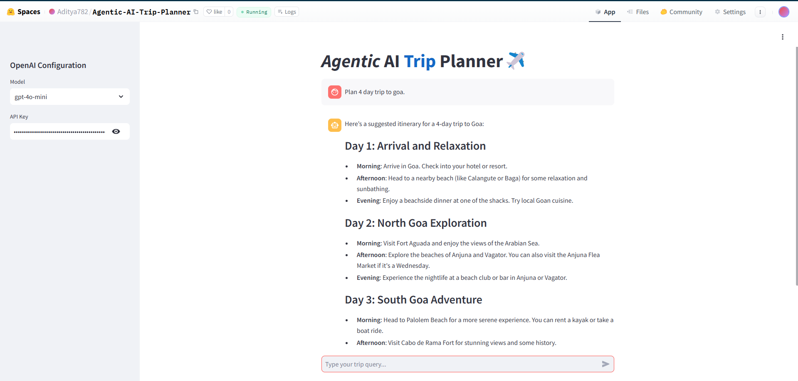

# Agentic-AI-Travel-Planner
### Welcome to the Agentic AI Trip Planner Project!
This repository contains an innovative AI-driven trip planning application. The project leverages the power of AI agents, utilizing the AutoGen framework, OpenAI LLMs, and LLAMA Index to create a seamless and interactive trip planning tool.
The core of the application is the Conversable Agent, an AI-driven entity capable of understanding and responding to user queries. It interacts with users in a conversational manner, providing suggestions, answering questions, and offering trip planning advice.
### Features
- **_Conversable AI Agent_**: Engage in natural conversations with an AI agent that assists in trip planning.
- **_Human-AI Interaction_**: Collaborate with an AI agent while retaining control over decisions and inputs.
- **_Group Chat with Round Robin Speaker Selection_**: Efficiently manage discussions and planning in group settings.
- **_Contextual Awareness_**: The AI can recall and use information from previous conversations to improve the planning process.
- **_Wikipedia Tool Integration_**: Ensure accuracy and reliability in trip information with real-time Wikipedia data.
### Getting Started
To start using the Agentic AI Trip Planner, you can run it locally using Docker or access the hosted version on Hugging Face Space.
#### Docker Setup
1. **Pull the Docker Image**
Run the following command to pull the Docker image:
```sh
docker pull adi1710/agent-trip-plan:v1
```
2. **Run the Docker Container**
Start the application using the following command:
```sh
docker run -it -p 8501:8501 agent-trip-plan:v1
```
#### Hosted Application
If you prefer not to run the application locally, you can access the hosted version on the Hugging Face Space. Check it out here 
<a href="https://huggingface.co/spaces/Aditya782/Agentic-AI-Trip-Planner/">
  
</a>



